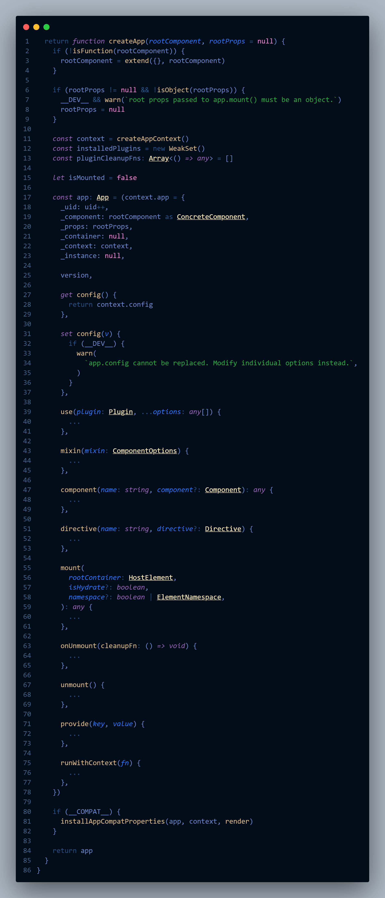
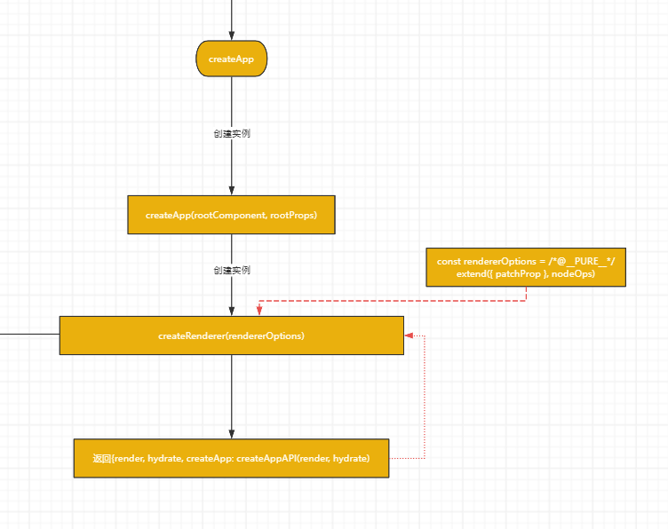
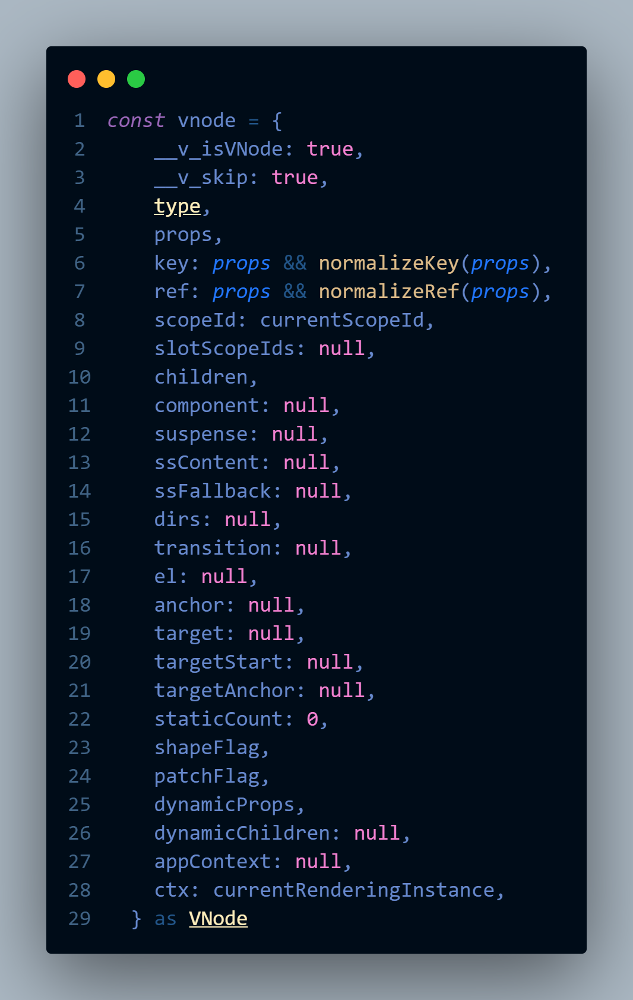

# 源码学习

[[toc]]

## 创建实例

使用`createApp`方法创建一个或多个实例，`createApp`支持两个参数: `rootComponent` 和 `rootProps`。
`createApp`方法大概执行以下几个步骤：

- 调用`createAppContext()`方法，创建一个app上下文。
- 初始化`plugins`变量。
- 创建app对象，其中包含`createApp`的参数、app上下文，以及实例的一些方法。
  
代码示例：

创建流程:

## 挂载实例

在创建实例后，调用`mount`方法时，对入参进行了处理，将`mount`入参为`String`类型的都变为`HTMLElement`类型，并且将`app._component.template`的值设置为`container.innerHTML`, `mount`方法中`createVNode(rootComponent, rootProps)`创建一个虚拟节点, 并执行`render`方法。

挂载实例的流程如下：

- `_createVNode(type, props)`获取`shapeFlag`的状态值，并且返回一个`createBaseVNode`方法的调用结果。
- `createBaseVNode`方法会首先初始化一个`vnode`对象

- 执行`render`方法，`render`方法会根据`shapeFlag`的值，执行不同的渲染逻辑。
- 最终都会执行`compileToFunction`方法，将`template`编译为`render`函数。
- `tokenizer.parse(template)`会解析`template`字符串，并且将解析的值放到`Tokenizer`对象的属性中。
